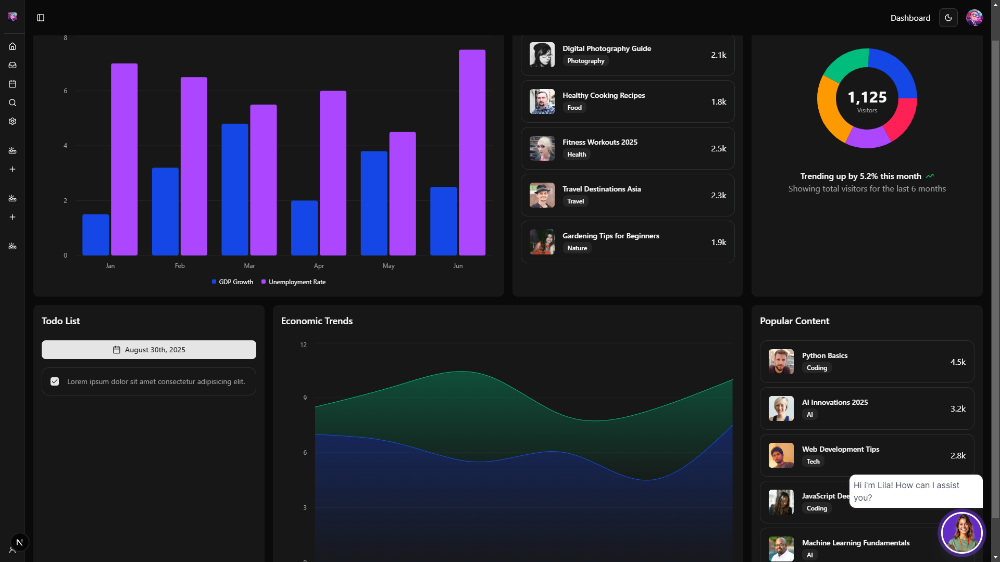
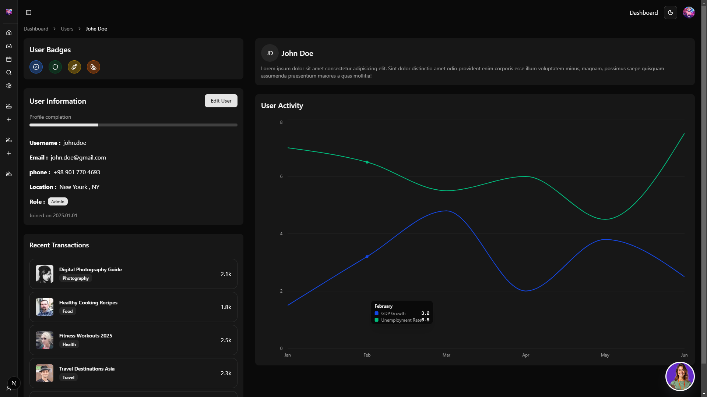
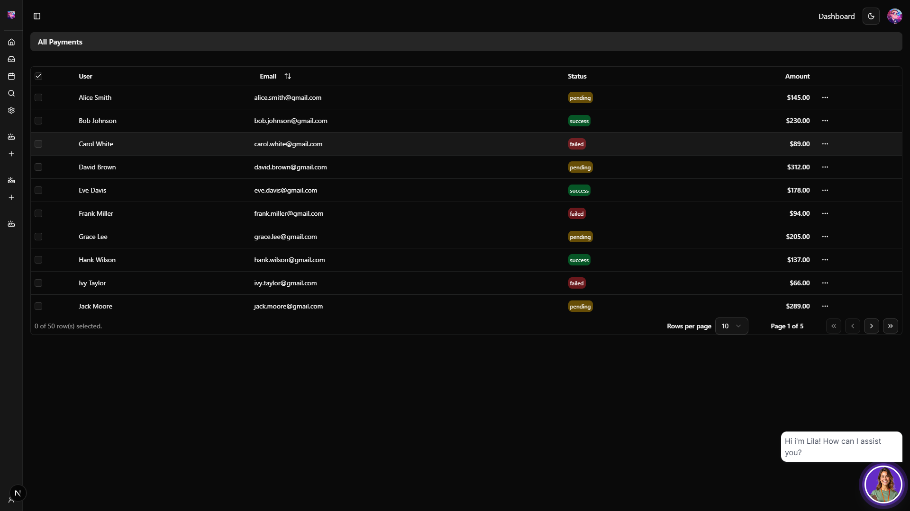

# Analytics Dashboard 🌟

  
_Main dashboard view showcasing economic data visualizations and user interactions. 📊_

## Overview 📋

Analytics Dashboard is a modern, responsive web application built to provide insightful data visualizations for economic trends, user activity, and browser usage. 🚀 It features dynamic charts, a customizable todo list, a calendar for scheduling, and an AI-powered chatbot named "Lila" 🤖 for querying data insights. The dashboard supports dark and light modes 🌙☀️ for better user experience, and includes personalized user profiles with activity tracking. 🎉 Designed for developers and data enthusiasts, this project demonstrates efficient data fetching and rendering in a sleek, intuitive interface.

## Features ✨

- **Dynamic Data Fetching**: Utilizes Next.js Server Actions 🔄 for secure and efficient API data retrieval, replacing static data with real-time economic metrics (e.g., GDP growth and unemployment rate) from mock APIs.
- **Varied Charts and Visualizations**: Includes Bar Charts 📈 for economic data comparison, Area Charts 📉 for trends over time, Pie Charts 🥧 for browser usage distribution, and Line Charts 📊 for user activity patterns – all powered by Recharts for smooth, interactive graphics.
- **Personalized Chatbot ("Lila")**: An AI-driven chatbot integrated into the dashboard, capable of answering queries about project data, economic insights, and user-specific information. 🤖 Lila provides natural language responses for a seamless experience.
- **User Profiles**: Dedicated user pages with profile completion status, badges 🏅, personal information (username, email, phone, location, role), recent transactions, and activity graphs.
- **Theme Support**: Toggle between Dark Mode 🌙 and Light Mode ☀️ for accessibility and user preference, using Tailwind CSS for seamless styling.
- **Responsive Design**: Fully mobile-friendly layout that adapts to desktops, tablets, and smartphones 📱💻.
- **Interactive Components**:
  - **Slider**: Customizable sliders 🎚️ for navigating through data sets or image carousels in transaction lists.
  - **Calendar**: Integrated calendar component 📅 for viewing and managing dates, such as todo deadlines or economic data timelines.
  - **Todo List**: A simple, persistent todo list with checkboxes ✅, due dates, and integration with the calendar for task management.
- **Additional Enhancements**:
  - Sidebar navigation for quick access to sections like Dashboard, Users, and Settings. 🗂️
  - Popular Content section highlighting trending items with user avatars and view counts. 🌐
  - Trending indicators (e.g., "Trending up by 5.2% this month") with icons for visual feedback. 📈
  - Accessibility features like ARIA labels and keyboard navigation. ♿
  - Error handling and loading states for robust user experience during data fetches. ⚙️

## Technologies Used 💻

- **Framework**: Next.js (for server-side rendering, API routes, and Server Actions) 🛠️
- **Language**: TypeScript (for type-safe code and better developer experience) 🔍
- **UI Library**: React (core component-based architecture) ⚛️
- **Styling**: Tailwind CSS (utility-first CSS for rapid, responsive design) 🎨 and Shadcn/UI (pre-built, customizable components)
- **Charts**: Recharts (for creating interactive and customizable data visualizations) 📊
- **Icons**: Lucide React (for modern, scalable icons like TrendingUp) 🌟
- **Other**: MockAPI.io (for simulated data endpoints), Lucide Icons, and built-in Next.js features for optimization 🚀

## Installation 🛠️

To set up the project locally, follow these steps:

1. **Clone the Repository**:git clone https://github.com/Davoudev/Analytics-dashboard.git
2. cd Analytics-dashboard

- **Install Dependencies**:
  npm install
  (Ensure you have Node.js v18+ installed.)

3. **Environment Setup**:

- Create a `.env.local` file in the root directory.
- Add any necessary API keys or variables (e.g., for mock APIs if extended).

4. **Run the Development Server**:
   npm run dev

- Open [http://localhost:3000](http://localhost:3000) in your browser to view the dashboard.

5. **Build for Production**:
   npm run build
   npm start

## Usage 🎮

- **Dashboard Navigation**: Use the sidebar to switch between views like Economic Data, User Profiles, and Settings. 🗺️
- **Interacting with Charts**: Hover over charts for tooltips with detailed data points. 📍
- **Chat with Lila**: Click the chatbot icon in the bottom-right corner to ask questions like "What's the GDP growth trend?" or "Show my recent activity." 🤖
- **Theme Toggle**: Switch between dark and light modes via the settings menu. 🌙☀️
- **Adding Todos**: In the Todo List section, add tasks with due dates linked to the calendar. ✅
- **User Management**: View and edit user profiles, including badges and activity logs. 👤

For deployment, host on platforms like Vercel or Netlify for automatic builds and serverless functions. 🚀

## Screenshots 📷

  
_User profile page with activity chart and personal details._

  
_Users List Page with Professional Slider ._

## Contributing 🤝

Contributions are welcome! Please fork the repository and submit a pull request. Ensure code follows TypeScript best practices and includes tests where applicable. ✅

## License 📜

This project is licensed under the MIT License. See the [LICENSE](LICENSE) file for details.

## Contact 📧

For questions or feedback, reach out via GitHub Issues or connect on X @Davoudev. Built in August 2025 as a portfolio project to showcase full-stack development skills. 🌐
